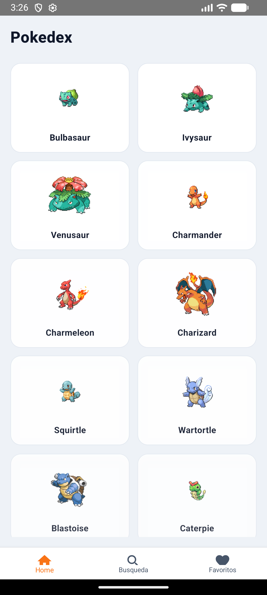
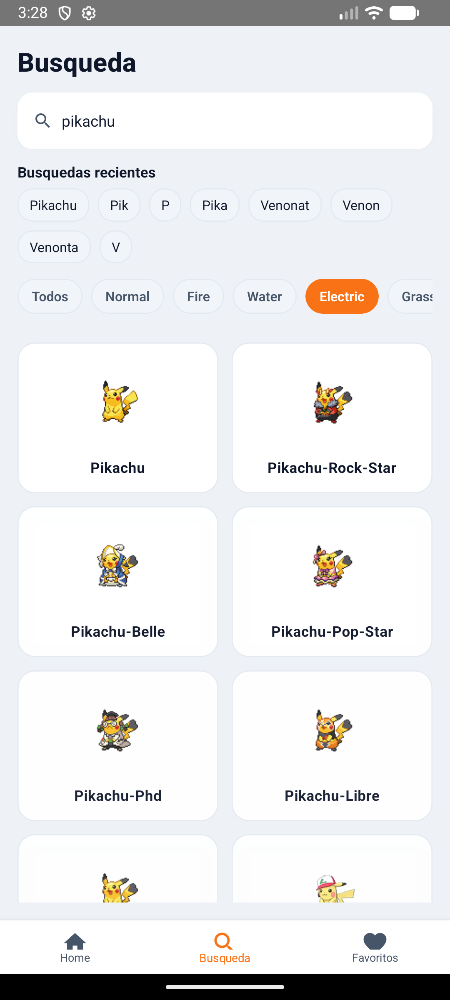
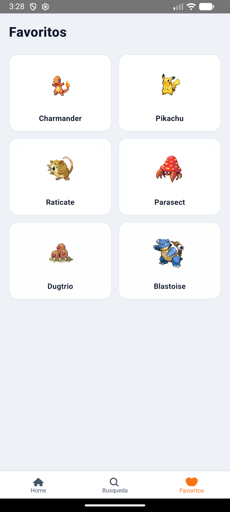
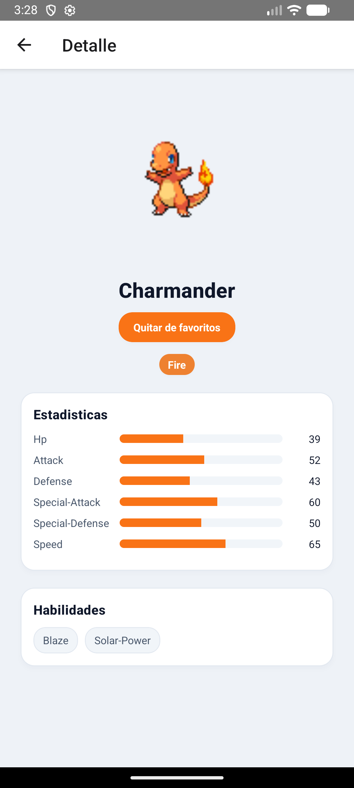

Proyecto React Native para la PokeAPI.

# Pokedex App

## Resumen

Aplicacion mobile que consume la PokeAPI con enfoque en arquitectura modular, offline-first, rendimiento y UX.

## Versiones usadas

- Plataforma: Windows
- Node: 18 LTS
- npm: 9+
- React Native: 0.74.5
- React: 18.2.0
- Java: JDK 17 (Temurin/Zulu recomendado)

## Stack tecnico

- React Native 0.74.5 + TypeScript
- Estado global: Zustand
- Data fetching/caching: React Query
- Navegacion: React Navigation (stack + bottom tabs)
- Persistencia: AsyncStorage
- Imagenes: react-native-fast-image
- Conectividad: NetInfo

## Endpoints usados

- https://pokeapi.co/api/v2/pokemon?offset=0&limit=20
- https://pokeapi.co/api/v2/pokemon/{name}
- https://pokeapi.co/api/v2/type/{name}
- https://pokeapi.co/api/v2/ability/{name}

## Decisiones tecnicas

- Arquitectura modular por feature en `src/features`, separando `Layout`, `styles`, `services` y `useFeatureController` para aislar UI, logica y servicios.
- Reutilizables en `src/shared` (components, hooks, utils, types) para evitar duplicacion y mantener consistencia.
- Estado global con Zustand para favoritos e historiales, por su simplicidad y rendimiento.
- Data fetching y cache con React Query, con persistencia a AsyncStorage para offline-first real.
- Offline-first con NetInfo para detectar conectividad y mostrar cache cuando no hay red.
- Navegacion con React Navigation (stack + bottom tabs) para separar flujos principales y detalle.
- Imagenes optimizadas con react-native-fast-image para cache y mejor rendimiento en listas.
- UI responsive con breakpoints y grid para soportar mobile, tablet y desktop.

## Arquitectura

```
src/
   app/
   core/
   features/
      pokemon-list/
      pokemon-detail/
      favorites/
      search/
   shared/
      components/
      hooks/
      utils/
      types/
   store/
```

Cada feature incluye: `index.ts`, `Layout.tsx`, `styles.ts`, `services.ts`, `useFeatureController.ts`.

## Offline-first y cache

- React Query con persistencia en AsyncStorage.
- Historial offline de busquedas y vistas.
- Pantallas muestran datos ya consultados sin conexion.

## Rendimiento

- Listas virtualizadas (`FlatList`) con paginacion.
- Debounce en busqueda por nombre.
- Imagenes cacheadas con `react-native-fast-image`.

## Scripts utiles

```bash
npm run lint
npm test
```

## Screenshots


Home: listado paginado con cards y scroll suave.


Busqueda: filtro por nombre y tipo, con historial visible.


Favoritos: tarjetas guardadas con acceso rapido al detalle.


Detalle: imagen, tipos, estadisticas y habilidades.

# Empezar

## Requisitos
- Node 18 LTS
- npm 9+
- React Native 0.74.5
- Java JDK 17
- Android Studio + SDK (Platform Tools, Emulator)
- Gradle Wrapper incluido en el repositorio

## Instalacion

```bash
npm install
```

## Configuracion en Windows (una sola vez)

Este script existe para evitar errores comunes de entorno en Windows (Java no detectado, SDK no encontrado, comandos de Android sin ruta). Configura `JAVA_HOME`, `ANDROID_HOME`, `ANDROID_SDK_ROOT` y actualiza `PATH` para que Gradle y el emulador encuentren el JDK y el SDK.

Ruta del script:

```
scripts/setup-windows.ps1
```

Pasos recomendados:

1. Abre PowerShell como administrador.
2. Ve a la raiz del proyecto.
3. Ejecuta el script.

```powershell
powershell -ExecutionPolicy Bypass -File scripts\setup-windows.ps1
```

Reinicia la terminal despues de ejecutar el script para que el `PATH` actualizado se aplique.

>**Nota**: Asegurate de completar la guia de [React Native - Environment Setup](https://reactnative.dev/docs/environment-setup) hasta el paso "Creating a new application" antes de continuar.

## Paso 1: iniciar Metro

Para iniciar Metro desde la raiz del proyecto:

```bash
# usando npm
npm start

# o usando Yarn
yarn start
```

## Paso 2: ejecutar la app

Deja Metro corriendo en su propia terminal. Abre otra terminal en la raiz del proyecto:

### Android

```bash
npm run android
```

### iOS

```bash
npm run ios
```

## Referencia de JAVA_HOME

Define `JAVA_HOME` apuntando a tu JDK 17, por ejemplo:

```
C:\Program Files\Eclipse Adoptium\jdk-17.x.x-hotspot
```

Si todo esta correctamente configurado, veras la app en el emulador de Android o el simulador de iOS.

## Paso 3: modificar la app

1. Abre `App.tsx` en tu editor y cambia algunas lineas.
2. Para **Android**: presiona <kbd>R</kbd> dos veces o usa **"Reload"** en el **Developer Menu** (<kbd>Ctrl</kbd> + <kbd>M</kbd> en Windows/Linux, o <kbd>Cmd ⌘</kbd> + <kbd>M</kbd> en macOS).

   Para **iOS**: presiona <kbd>Cmd ⌘</kbd> + <kbd>R</kbd> en el simulador.

# Troubleshooting

Si algo falla, revisa la guia de [Troubleshooting](https://reactnative.dev/docs/troubleshooting).

# Aprender mas

- [React Native Website](https://reactnative.dev)
- [Getting Started](https://reactnative.dev/docs/environment-setup)
- [Learn the Basics](https://reactnative.dev/docs/getting-started)
- [Blog](https://reactnative.dev/blog)
- [`@facebook/react-native`](https://github.com/facebook/react-native)
